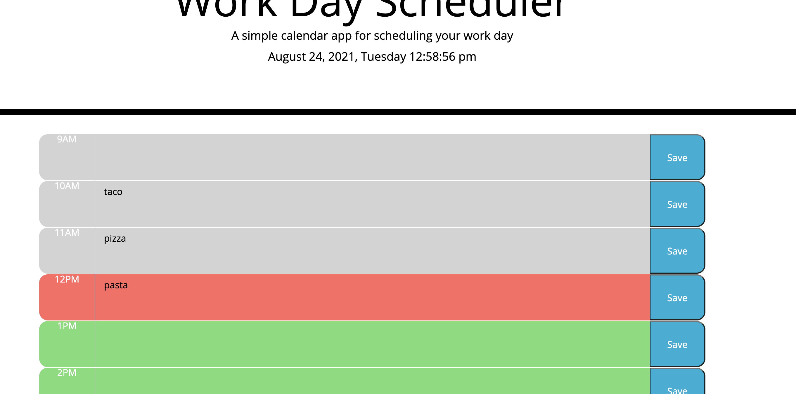

# Work Day Scheduler Starter Code

Created a schedule where you can input text into time blocks and save them so when you refresh the page it keeps the data previously put in, the blocks are also color coded to reflect past present and future as well as show current time

Given starter code of css and html, created the javascript using jquery and moment.js libraries to create functions

